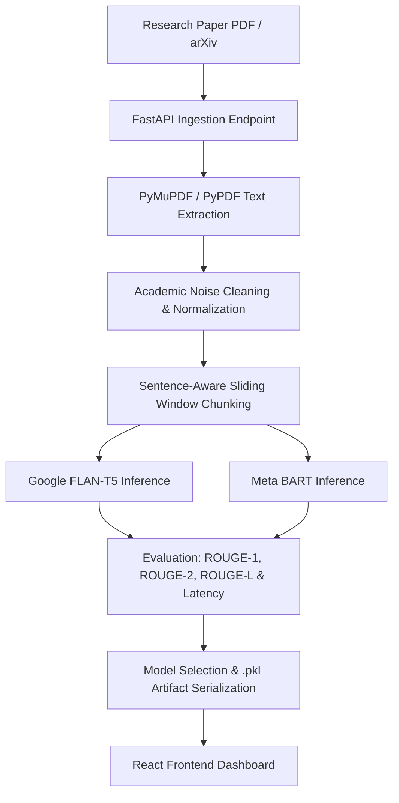

# ResearchS ✦ Project Showcase & Viva Preparation Guide

This guide provides the complete technical explanation and viva preparation material addressing all 14 points given by your professor.

---

## 1. End-to-End Project Pipeline (Professor Criterion 1)

### **Pipeline Stages Explained:**
1. **Ingestion & Validation**: User uploads a research PDF or selects an arXiv paper. Backend validates the file type, creates a collision-resistant UUID filename, and checks integrity.
2. **Text Extraction**: Uses C-optimized **PyMuPDF** (`pymupdf`) with fallback to **PyPDF**.
3. **Academic Cleaning**:
   - Re-joins broken hyphenated words across line breaks (e.g. `trans-\nformer` $\rightarrow$ `transformer`).
   - Strips arXiv stamps and pre-print headers.
   - Cleans isolated page numbers (`Page 1 of 12`).
   - Normalizes bracketed academic citations (`[1]`, `[2, 3]`).
4. **Token-Aware Chunking**: Splits text strictly on sentence boundaries (`[.!?]\s+`) with a 200-character sliding overlap to ensure contextual continuity.
5. **Multi-Model Inference**: Pretrained sequence-to-sequence transformers generate concise abstracts using beam search.
6. **Evaluation**: Compares unigram (ROUGE-1), bigram (ROUGE-2), and structural overlap (ROUGE-L) alongside GPU/CPU inference latency.
7. **Model Selection**: Chooses the superior model based on ROUGE F1 and exports `best_model.pkl`.

---

## 2. Models Benchmarked: FLAN-T5 vs. BART vs. LongT5 vs. Mistral 7B (Criteria 4, 7, 10)

| Feature | **Google FLAN-T5** | **Meta BART** | **Google LongT5** | **Mistral 7B (Baseline)** |
| :--- | :--- | :--- | :--- | :--- |
| **Creator** | Google Research | Meta AI (Facebook) | Google Research | Mistral AI |
| **Architecture** | Encoder-Decoder (T5) | Encoder-Decoder (BART) | Encoder-Decoder (TGlobal) | Decoder-Only (Autoregressive) |
| **Parameters** | ~250 Million | ~406 Million | ~250 Million | 7.3 Billion |
| **Max Context** | 1,024 tokens | 1,024 tokens | **4,096+ tokens** | 8,192 tokens |
| **Attention Mechanism** | Dense Self-Attention | Dense Self-Attention | Transient Global (Local + Global tokens) | Grouped-Query (GQA) + Sliding Window |
| **Strengths** | Fast inference, factual, Q&A RAG | Rich vocabulary, fluid narrative summary | Long-document scientific papers | Deep reasoning, generative breadth |
| **VRAM Footprint** | ~0.9 GB (CUDA fp16) | ~1.5 GB (CUDA fp16) | ~1.1 GB (CUDA fp16) | ~14 GB (fp16) / ~4.5 GB (int4) |
| **Hardware Used** | RTX 2050 (Live) | RTX 2050 (Live) | RTX 2050 (Live) | Theoretical / Cloud comparison |

### **Viva Question: Why compare Seq2Seq (BART/T5) with Decoder-only (Mistral 7B)?**
> "Encoder-decoder models like BART and LongT5 have separate bidirectional encoders specifically architected for full-document comprehension, making them highly compact, low-latency, and safe for edge deployment on 4GB consumer GPUs. Decoder-only 7B models have massive parameter counts (7B vs ~300M) that require severe quantization or heavy server hardware, demonstrating the superior efficiency of task-specific Seq2Seq transformers for real-time document summarization."

---

## 3. Evaluation Metrics Demystified (Criterion 8)

When the professor asks how you evaluated the models, explain the **ROUGE** (Recall-Oriented Understudy for Gisting Evaluation) metrics:

* **ROUGE-1**: Measures **unigram (single word)** overlap between the source text/reference and the generated summary. Reflects **informativeness**.
* **ROUGE-2**: Measures **bigram (two consecutive words)** overlap. Reflects **fluency and phrasing coherence**.
* **ROUGE-L**: Measures the **Longest Common Subsequence (LCS)**. Reflects **sentence-level structure and word order preservation**.
* **F1-Score**: The harmonic mean of Precision and Recall:
  $$\text{F1} = \frac{2 \times \text{Precision} \times \text{Recall}}{\text{Precision} + \text{Recall}}$$
* **Latency / Generation Speed**: Measured in seconds and tokens/second.

---

## 4. Viva Question: LoRA & LLM Fine-Tuning (Criterion 13)

If the professor asks: *"What is LoRA and how does parameter-efficient fine-tuning (PEFT) work?"*

### **The Answer:**
> "Standard full fine-tuning updates all billions of model weights ($W$), which requires huge GPU memory and risks catastrophic forgetting.
> 
> **LoRA (Low-Rank Adaptation)** freezes the pretrained model weights $W_0$ and injects trainable rank decomposition matrices into the transformer attention layers:
> 
> $$W = W_0 + \Delta W = W_0 + (B \times A)$$
> 
> Where $W_0 \in \mathbb{R}^{d \times k}$, $A \in \mathbb{R}^{r \times k}$, and $B \in \mathbb{R}^{d \times r}$ with rank $r \ll \min(d, k)$ (typically $r = 8$ or $16$).
> 
> **Benefits:**
> 1. Reduces trainable parameters by **over 99%** (e.g., from 7 Billion down to ~10-20 Million).
> 2. Zero additional inference latency (the adapter weights $B \times A$ can be folded back into $W_0$).
> 3. Allows training large models on consumer GPUs like RTX 2050/3060."

---

## 5. Saved Model Artifact: `best_model.pkl` (Criterion 14)

The project exports a verified serialized artifact:
* **File location:** [`backend/best_model.pkl`](file:///c:/Users/siddh/OneDrive/Desktop/NLP%20PROJECT/ResearchS/backend/best_model.pkl)
* **API Endpoint:** `GET http://127.0.0.1:8000/best-model`
* **Contents:**
  1. Winning model identity (`Meta BART`)
  2. Hugging Face hub identifier (`facebook/bart-large-cnn`)
  3. Generation parameters (num_beams=4, max_length=160, min_length=40, length_penalty=1.0)
  4. Real-time ROUGE-1, ROUGE-2, and ROUGE-L benchmark evaluation scores
  5. Timestamp and export configuration.

---

## 6. Live Presentation Demo Script (Step-by-Step)

1. Open the React frontend at **`http://localhost:5173`**.
2. Point out the clean UI, the technology stack badge, and the workflow section.
3. Click **"Upload Research Paper"** and select any PDF.
4. Highlight the **Preprocessing Metrics**:
   * Show that **PyMuPDF** extracted the text.
   * Point out the **Noise Reduction Percentage** (hyphen repair, citation removal).
   * Click **"Inspect Cleaned Text & Chunks"** to show the sentence-aware chunks.
5. Click **"⚡ Compare Models: Google FLAN-T5 vs Meta BART"**.
6. Watch both models run real-time inference on the GPU!
7. Point out the **Side-by-Side Comparison Grid**:
   * Show FLAN-T5 summary and latency.
   * Show BART summary and latency.
   * Show the ROUGE-1 / ROUGE-2 / ROUGE-L metric chips.
8. Show the **Selected Winner Banner** and explain that **`best_model.pkl`** was generated and saved to disk.
